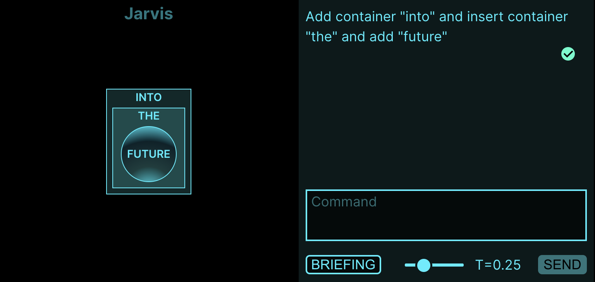

# Jarvis
Visual playground for [LM](https://en.wikipedia.org/wiki/Language_model) conversations on nested objects using the [OpenAI API](https://openai.com/api/)

[](https://youtu.be/H9257HeQyW8)

Read more on Medium: https://medium.com/@danielhopp/jarvis-67ff498e34d6

## Installation

An [OpenAI API key](https://platform.openai.com/account/api-keys) is required:
```sh
docker build -t jarvis . 
docker run -d -e OPENAI_API_KEY=<YOUR_OPENAI_API_KEY> -e PASSWORD=<YOUR_SECRET_PASSWORD> -p 80:80 jarvis
```

IMPORTANT NOTICE: Unless in a protected network environment, make sure you provide a secure `PASSWORD` or you will [relay your OpenAI API account into the public](https://openai.com/api/pricing/).

## License
MIT (http://www.opensource.org/licenses/mit-license.php)
